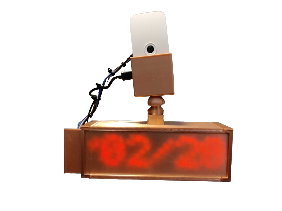
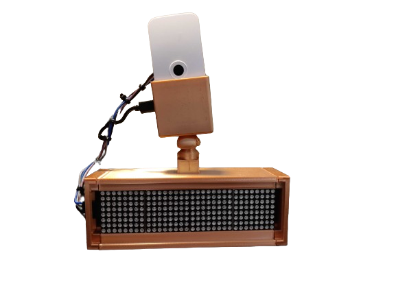
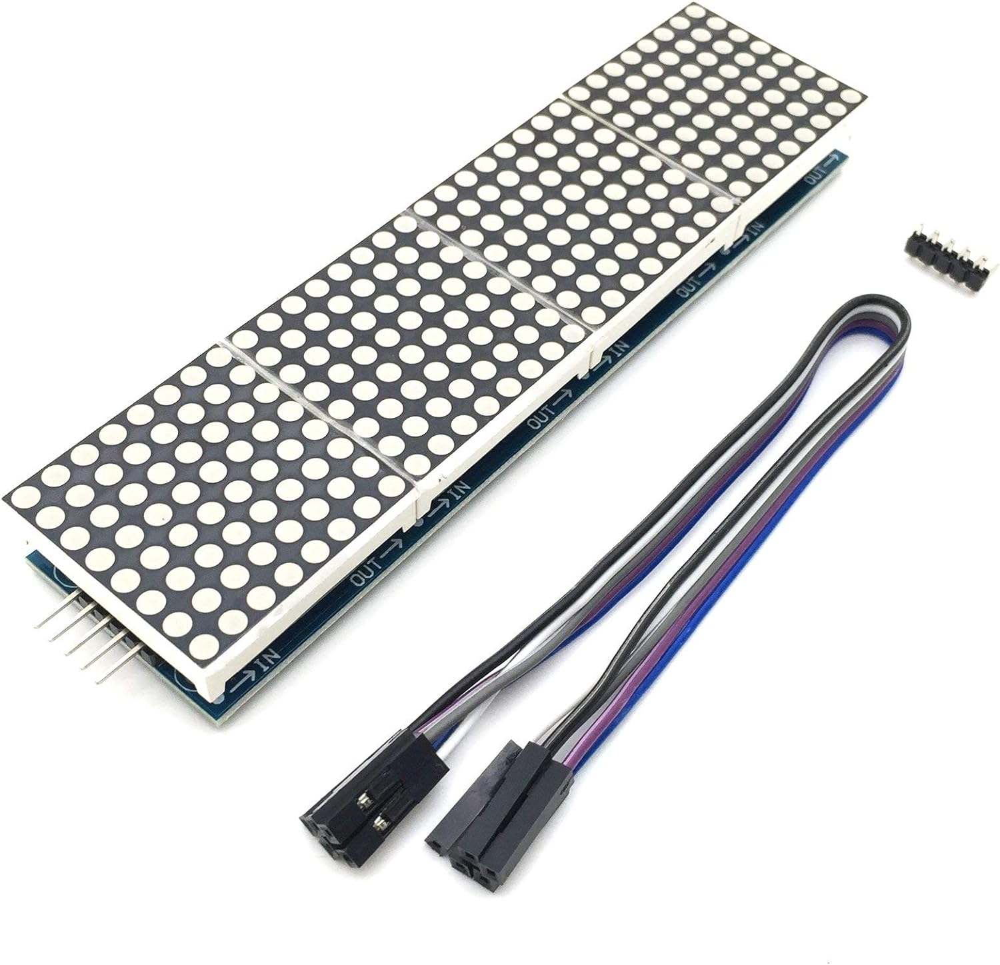
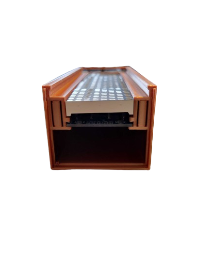
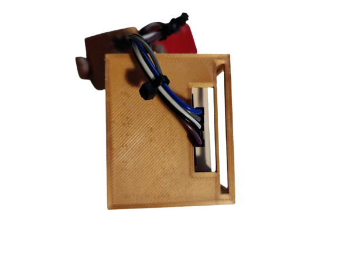
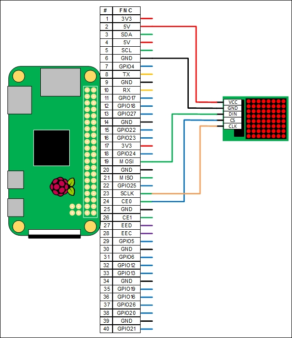
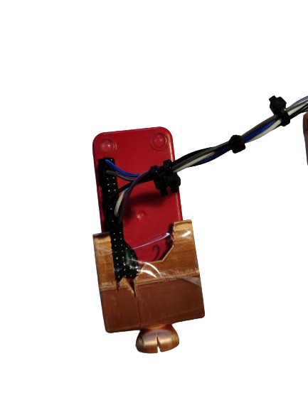

# Clock Matrix with Raspberry Pi Zero and 4x1 Dot matrix (MAX7219)




I wanted to use some hardware I had lying around to build a simple clock that I could keep in my room with a webcam I could position to monitor different things while I was away. 

The camera is overkill for this build and absolutely not a requirement.

**You will need to solder pins to the GPIO entries of the Raspberry Pi Zero W to connect to the Dot Matrix. Make sure the long end of the pins are facing the _back_ of the Raspberry Pi.** If you have never done this before, you can find great tutorials online to guide you through the process, [like this one by Bas van der Sluis](https://www.youtube.com/watch?v=UDdbaMk39tM&ab_channel=BasvanderSluis).

Below is a picture of a Raspberry Pi Zero with the GPIO pins soldered facing the back of the Pi (ignore the bad soldering from the picture, I picked it of the internet):


## Resources you'll need

- Raspberry Pi Zero W 
- Raspberry Pi Zero W Official Case
- Raspberry Pi Zero Camera (any revision that suits the case, I used a Rev 1.3)
- An SD card and power cable for the Raspberry Pi
- A 4x1 dot matrix - Make sure you purchase one with the pins facing horizontally to the side of matrix, not the ones with the vertical pins (see below)
- 5 Female to Female GPIO Cables (additional Male/Female cables (or simply long Female/Female cables) as needed if you are planning to extend the length of the Raspberry Pi mount)
- A 3D printer and filament
- Strong multipurpose glue
- Small cable zips (optional, to keep the matrix cables together)

The correct Dot Matrix for this build looks like this (with horizontal pins): 



## Printing

A big thanks to moonlander for his ["LED Matrix Modular Case System"](https://www.thingiverse.com/thing:2811071) which I heavily used for this design with some improvements to fit my needs.

I also used an existing Raspberry Pi Zero case mount designed by lorsmeister which can be found [here](https://www.printables.com/en/model/136081-easy-raspberry-pi-zero-mount/) as well as the relevant [links and knobs from mkoistinen](https://www.printables.com/model/25205-flexi-arm-camera-mount/files).

The stl files used for this print are located in the ``3d_files`` folder. There are a total of seven items to print: 

- The main case
- The female case end cap
- The male case end cap
- The front panel (or as referred elsewhere in this guide as the lid)
- The arm mount for the Raspberry Pi
- The knob to attach to the top of the case
- Printing the links is not a requirement. If you only intend to use a single cable to connect the Matrix to Raspberry Pi, the links are not required. If you are planning to have a camera mount that is longer or adjustable, you will need to print links are needed (and purchase the right length of cable or connect multiple cables together)

I used PLA for this print (SUNLU PLA Plus Shiny Silk in red copper, can be found on Amazon) and my trusted Creality CR 20 Pro. 

The total build time was 12h19m with 110g of filament.

Infill: 20%
Print speed: 80mm/s
Support pattern: Gyroid
Support: Normal, touching build plate

Note: I printed the parts in multiple prints which resulted to a change in colour of the parts. I suspect this is linked to the filament absorbing humidity during each print phase (they were quite long), rather than the filament itself. I recommend you print it all in one go to avoid this issue, otherwise use a filament dryer to maintain the filament humidity at approximately the same level between prints (you're aiming for below 30%). I use the SUNLU Filament Dryer S2, available on Amazon.

## Assembly & wiring

### Assembling the case

The female case end cap should face to the left of the clock, as the power cable that connects to the Raspberry Pi will face the left as well. You can invert it if needed, but I found that aesthetically and practically it was easier to have all the cables facing the same direction. You will assemble the case by following the steps below.

- Set aside the lid for the moment
- Connect the cables to the Matrix 
- Slide the matrix into the case. You will notice a rail made for the circuit board to slide into (see image below)
  
- Fix the male case end cap to the right of the case (you can add super glue if you wish)
- Slide the female case en cap through the cable (see image below)
  
- Fix the female case end cap (you can add super glue if you wish)
- Add the lid as needed. You will notice there is little tolerance available to slide the lid in place. I recommend you either print it a little less wide or file the corners a little to make it easier to slide in place. 

### Connecting the matrix to the Raspberry Pi

Below is a diagram on the wiring of the Dot Matrix to the Raspberry Pi Zero W. Make sure you assemble connect the cables to the matrix and assemble it with the case first. It will make it easier to manipulate and then connect to the Raspberry Pi.

Beware: you should have soldered the pins facing the back of the Raspberry Pi, therefore make sure that you select the correct pins when comparing it to the diagram. 



For a better reference, below is the Raspberry Pi Zero Pinout schema:


### Finalising the assembly

You will then need to attach the knob to the top of the case. I have found that there is too much tolerance and it slides a little too much. To fix this, I superglued the knob to the case. 

You can then add links as needed, depending on the length of the cables you have used.

Next: 
- insert the SD card into the Raspberry Pi (make sure you've flashed Debian on it first!)
- Connect the camera to the Raspberry Pi
- Close the case

You will realise at this point that there is no space for the Pi inside the case because of the GPIO pins. I did not account for this at first and just cut the PLA to fit my need, fixing the Pi to the case with scotch tape. Because it's all facing the back of the clock, I found that it did not mess with the aesthetics of the case. The final result looks like the image below:



The end result should look like the images at the top of the page. Plug in the Pi to power and head to the software setup. 

## Software 

I'm assuming you are familiar with the Raspberry Pi and have already set it up with the latest version of Debian. If you've never done this before, I recommend you follow [the getting started guide from the Raspberry Pi official documentation](https://www.raspberrypi.com/documentation/computers/getting-started.html)

Note: The Raspberry Pi Zero does not have a lot of processing power, the startup (especially first startup) can be quite slow so be patient. 

Note (2): Make sure you run these commands in the root directory (e.g ``/home/<username>``). It is not a requirement but will have an important for the cron execution path.

### Setting up the matrix

You will need to install the MAX7219 module in order to use the dot matrix. 
[You can follow this guide for the installation](https://luma-led-matrix.readthedocs.io/en/latest/install.html).

### Setting up the clock

Copy and paste the clock.py file into your user root directory. 

**You will need a working internet connection to the Raspberry Pi. This is required to get the correct date and time.**

Below are some explanations on what the script does

The first thing we do is import the time and datetime native libraries in order to get the device date and time (this is where having a working internet connection is necessary, otherwise you will end up with an incorrect date and time).

```
import time
import datetime
```

We then import the required modules from the luma library. You can find out more about the luma library [here](https://github.com/rm-hull/luma.led_matrix), as well as example code to try out. 

```
from luma.led_matrix.device import max7219
from luma.core.interface.serial import spi, noop
from luma.core.legacy import show_message
from luma.core.legacy.font import (
    proportional,
    LCD_FONT,
)
```

The main function at the bottom of the file simply runs the main function run() every 5 seconds. You can modify the sleep time depending on your needs, however I have found that waiting a 5 seconds ensures that there are no issues when you launch the script at startup. 

```
if __name__ == "__main__":
    try:
        time.sleep(5)
        run()
    except KeyboardInterrupt:
        pass
    except Exception as e:
        print("Error in main: ", e)
```

The run function is where the logic happens. 
The first thing it does is initialises the matrix setting, amongst other things, the block orientation.
We then setup an infinite loop to acquire the current date and time and display it. We use the standard font and a comfortable scroll delay to display the message. Once the message has been displayed, the loop starts again. 

```
def run():
    try:
        print("running clock...")

        serial = spi(port=0, device=0, gpio=noop())
        device = max7219(
            serial,
            cascaded=4,
            block_orientation=-90,
            rotate=0,
            blocks_arranged_in_reverse_order=False,
        )

        while True:
            now = datetime.datetime.now().strftime("%d/%m/%Y, %H:%M:%S")
            print("date and time:", now)
            show_message(
                device,
                now,
                fill="white",
                font=proportional(LCD_FONT),
                scroll_delay=0.02,
            )

    except Exception as e:
        print("Error: ", e)
```

You can test the script first by running ``python3 clock.py``.

There are a number of parameters you can change using the luma library (font, scrolling speed, size, orientation, etc.), refer to their documentation for more information.

### Setting up the webcam (optional)

There are different ways to setup the camera on the Raspberry Pi. The easiest and optimal way of doing it is by using MotionEye. This also allows manage multiple cameras on your network. 

A guide to setting up MotionEye is available [here](https://github.com/motioneye-project/motioneye/wiki/Installation). 

### Configuration for start on boot

We use cron to start the script on boot. To do this: 

- run ``sudo crontab -e``. I recommend you use sudo here to avoid user access right issues when booting up the Pi. Although from a security standpoint it is not a good practice, also make sure that you auto-login (sudo raspi-config) when booting up the Pi.
- add the following line ``@reboot cd /home/<username> && python3 clock.py &``, making sure you replace your username and have the ``&`` at the end of the line. If you've changed the filename, make sure it is correct here as well. It should look something like this: ``@reboot cd /home/pi && python3 clock.py &``


## Final comments

This build could definitely improved, I've noted some improvements in the section below. The main issues I have with this build are:
- the lid is not thick enough to hide the light of the matrix 
- the matrix tends to make a slight screeching noise when it is on, particularly when the text is being displayed

As I have this clock right next to my bed, I find the screeching noise and light disturbing when I sleep. To fix this and not have to plug/unplug the clock every day, I've connected the Raspberry Pi through a Smart Power Socket configured with Smart Life to turn on and off on a pre-defined schedule. You can find a wide range of affordable smart plugs on Amazon to do this.

## Future improvements

- The case holding the Raspberry Pi could be remodelled to account for the GPIO pins.
- The Raspberry Pi mount could be joined together to fix stability issues
- Longer cables could improve the stability of the camera
- The width of the lid could be reduced by 0.5mm to reduce friction with the case
- The lack of opacity in the lid could be improved by printing the lid with a different color of PLA, additional infill or a different infill structure.
- Currently the time is acquired on an infinite loop inside the run() function. This is generally not a good practice and a better way might be to schedule a run of the script at regular intervals using cron. This however generates multiple initilisations of the matrix module and makes error handling a little more complicated. A better approach could be investigated.

Finally, if you do not need a webcam for this build, the case could be improved to hide the Raspberry Pi and cables inside the case (you'll also need to remove the knob at the top of the case). 